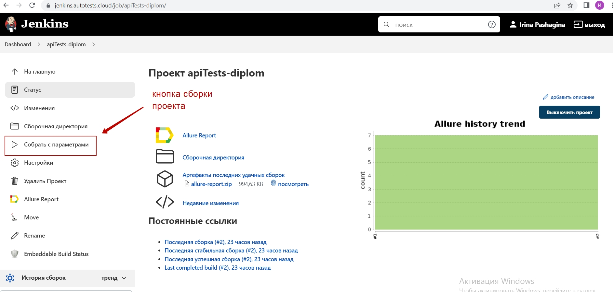
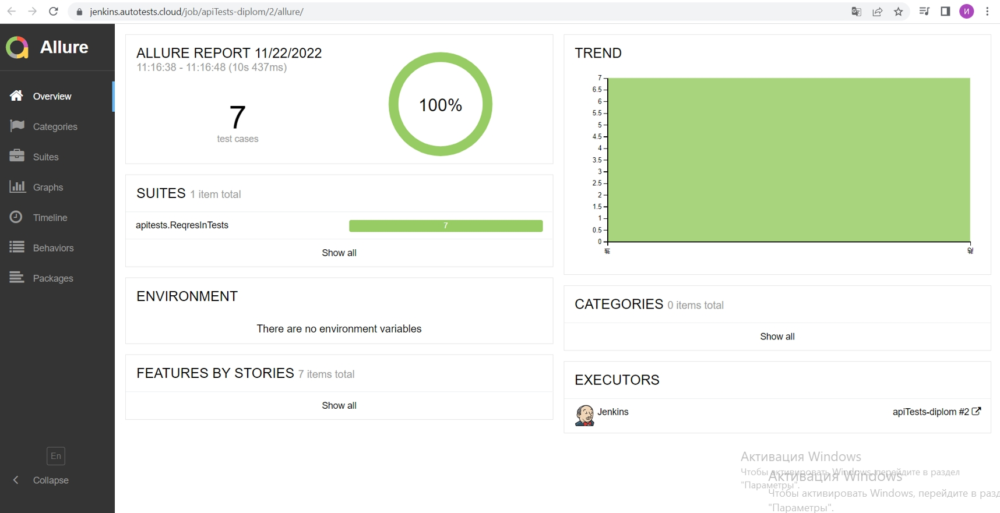
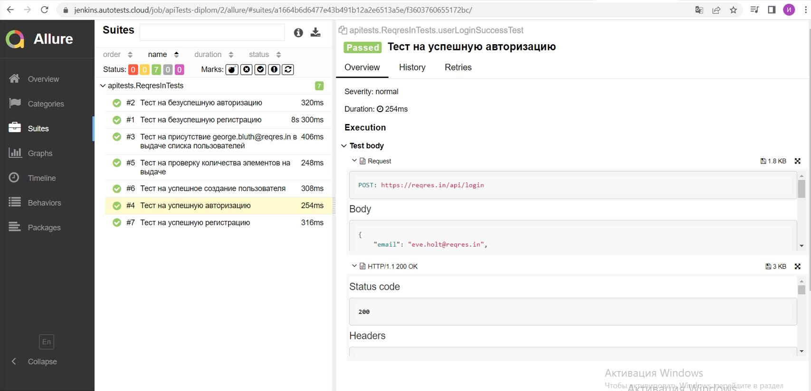
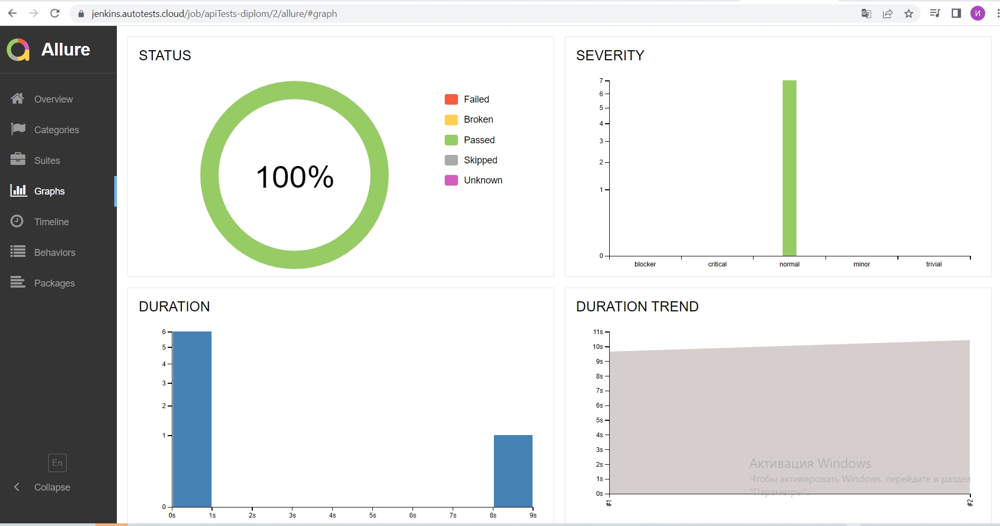

# Дипломный проект по API тестированию для [reqres.in](https://reqres.in/)

## Содержание:

* [Технологии и инструменты](#rocket-технологии-и-инструменты)
* [Реализованные проверки](#scroll-реализованные-проверки)
* [Сборка в Jenkins](#-jenkins-job)
* [Allure отчет](#earth_africa-Allure-отчет)
* [Отчет в Telegram](#-уведомление-в-telegram-при-помощи-бота)

## :rocket: Технологии и инструменты

## :scroll: Реализованные-проверки

✓ Тест на успешное создание пользовател

✓ Тест на успешную регистрацию

✓ Тест на безуспешную регистрацию

✓ Тест на успешную авторизацию

✓ Тест на безуспешную авторизацию

✓ Тест на присутствие пользователя в выдаче

✓ Тест на проверку количества элементов на выдаче

## Сборка в <a  target="_blank" href ="https://jenkins.autotests.cloud/job/apiTests-diplom/">Jenkins:</a>

##  Отчет в <a target="_blank" href="https://jenkins.autotests.cloud/job/apiTests-diplom/allure/">Allure report</a>

### Главное окно

### Окно с тестовыми кейсами

### Окно с графиками

##  Уведомление в Telegram при помощи бота

После завершения тестов отчет о прохождении приходит в Telegram с помощью заранее созданного бота

